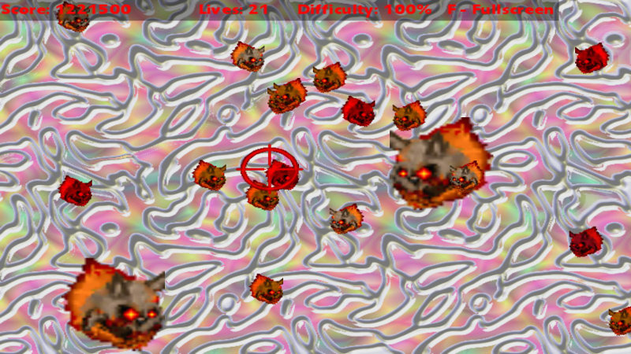
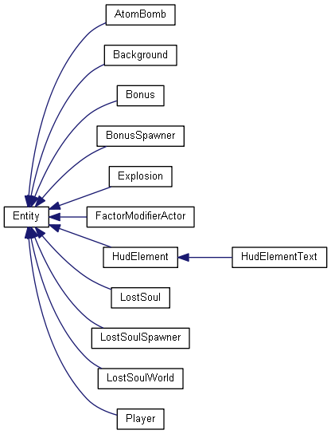
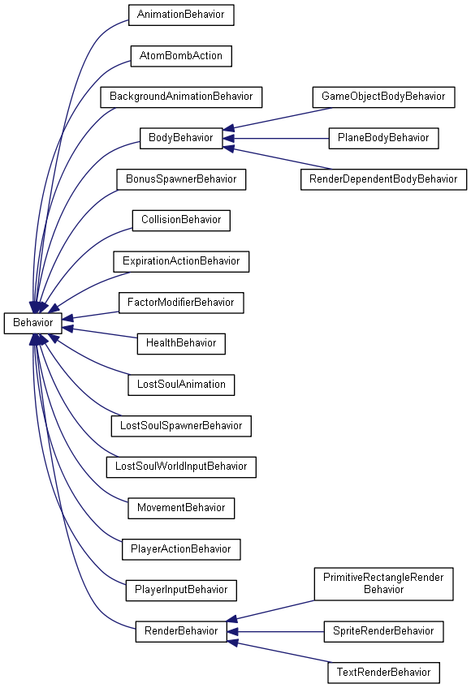

# Story

Seals of Hell have been broken and damned souls are escaping. As a
demonic guardian, you're supposed to keep them safe. Be a good
shepherd and blast them back to the fiery pits of Hell so that they
don't get lost. Click on the screen to fire and collect bonuses which
will help you.

# What is this?

This is a 2D 'bug squasher' game that revolves on a single screen with
infinitely spawning "bugs" (cockroaches) that need to be destroyed by
pointing crosshair at them and pressing left mouse button. Difficulty
increases gradually, up to a certain point, and the game also randomly
spawns bonuses to help the player. Bonuses consist of screen wipe,
enemy slow down, difficulty decrease and extra lives. Audio in form of
sound effects and ambient music is present. Backgrounds change
randomly. Game ends when too many "bugs" escape.

# Why?

The goal of this project was an exercise on building a component
(composition) based game. The game was meant to be simple so that it
could be done in a short period of time. In order to provide
complexity to the game and to the code, following features are
present:

- Audio (sound effects and background music).
- Different types of enemies (appearance & behavior).
- Randomly spawning bonuses with different graphics and results.
- Cycling backgrounds.
- Auto-incrementing difficulty.
- Score and lives tracking.
- "Game Over" screen with possibility to restart.
- HUD with text.
- Mouse & keyboard input.
- Fullscreen & windowed support:
  - fullscreen defaults to desktop resolution
  - windowed mode defaults to XNA's defaults.

# Supported OSes

I was developing this on Windows 7. If you have problems running it,
keep in mind that it requires .NET 4.0 runtime and XNA runtime.

# User input

- Escape - quit
- Mouse - move crosshair around
- Left Mouse Button - fire
- Right Mouse Button - reset game on Game Over screen.
- F - fullscreen/windowed mode toggling
- ] - cycle background

# C# disclaimer

I work in C++, Java and Python on a daily basis. If you're a seasoned
C# programmer you will probably find sections of code that could've
been done better. Please, don't hesitate to point them out. I welcome
any kind of constructive remarks.

# Architecture

Game architecture is based on composition design model. The main
doctrine of this model is that the game's Entity class shouldn't be
anything more than a collection of components that define its behavior
and appearance.

If you'd like to read about the concept of composition based
architecture here are some URLs that might help you:

- http://gamedevelopment.tutsplus.com/tutorials/avoiding-the-blob-antipattern-a-pragmatic-approach-to-entity-composition--gamedev-1113
- http://cowboyprogramming.com/2007/01/05/evolve-your-heirachy/
- http://gameprogrammingpatterns.com/

This document describes how it's done in this case.

## The rule of Demeter

It's broken here in multiple instances and all over the place. In
exchange there are no singletons.

## The 'Main' class - LostSoulGame

Besides the uninteresting entry point in Program.cs file, the main
class is the [LostSoulGame](LostSoul/LostSoulGame.cs) class. It
inherits directly from XNA's Game class which already defines some
steps in which the game is initialized and then run. I won't be going
into much detail on how XNA's Game framework works as this is
excellently described in XNA/Monogame tutorials sections on
http://rbwhitaker.wikidot.com/ . In short, this is the order in which
the methods are called by the framework:

1. LostSoulGame constructor - variables initialization and event connections.
2. LostSoulGame.Initialize() - audio system is initialized here.
3. LostSoulGame.LoadContent() - game audio and picture media is loaded
   here. The level/world/map/whatever-you-call-it is also initialized
   here. All media content is loaded at once and kept in memory
   indefinitely. This is okay due to the nature and size of the game,
   but I imagine a more serious project would require a better content
   management.
4. From now on XNA takes over and calls Update() and Draw() in
   repeated cycles. This occurs until the game calls Game.Exit(), upon
   which XNA closes the game. Draw() method draws all objects on the
   screen while Update() handles everything that is not explicitly
   drawing (even the animation!). Whenever Update() or Draw() is
   mentioned in this file, it refers to an Update() or Draw() call
   that is analogous to the Game.Update() and Game.Draw() and that its
   call trace can trace back to these top methods.

Job of LostSoulGame class is to provide access to all global systems:
graphics, sprite render, input state delta, and media content. It also
keeps handle to currently running LostSoulWorld, and updates audio
listener position according to the dimensions of the world. Upon a
call to Update() it fires all sounds enqueued in AudioSystem. Before
leaving Update() the state of user input (keyboard & mouse) is stored
in memory so that it can be compared to new state in succeeding
Update() frame. LostSoulGame also handles switching between fullscreen
and windowed modes and makes the mouse cursor visible or hidden
depending on the 'IsActive' state of the game window. That's pretty
much it.

## The 'World' class

[LostSoulWorld](LostSoul/LostSoulWorld.cs) is the class that holds the
current state of the game. If you want to reset the game, you just
need to instruct LostSoulGame to reinstantiate this World class. It
keeps handles to all Entities which are in the game. It instantiates
several important Entities that live throughout the entire World such
as 'Player', 'Background', 'Enemy' and 'Bonus' spawners or 'HUD' (Yes,
HUD and all HUD elements are also Entities derived from Entity class!)
It orders the way in which Entities are drawn. Lastly, it also keeps
handles to all entities for which the mutual drawing order isn't
important, such as enemies, explosions and bonuses.

**Constant actors:** Player, Background, spawners and HUD never
expire. They're kept as separate properties of LostSoulWorld
class. Their types are specific, so "Player" object is of "Player"
type and can be accessed by other classes. For example Player.Score is
accessed and modified directly by Bonus and LostSoul classes. Constant
actors also have predefined Update() and Draw() order to ensure that,
for example, Background is always drawn behind everything else, and
Player is drawn above anything else, besides HUD which is always on
the top.

LostSoulWorld monitors Player's HealthBehavior and switches to "Game
Over" screen on Player.HealthBehavior.DeathEvent.

**Expirable actors:** Entity objects that live only through a certain
period of time consist of Bonuses, LostSouls and Explosions. They're
stored on a common list. Ordering of this list is unimportant, but
still all Entities there are Updated() and Drawn() in order from
oldest to youngest. When a new Entity is added through
LostSoulWorld.AddActor(), this entity is first appended to `newActors`
list. This list is omitted in Update() and Draw() period. This
prevents concurrent modification the actors list that can be currently
iterated on, so it's safe to call AddActor from any place in the
code. All `newActors` are moved to actual actors list on the beginning
of LostSoulWorld.Update() call.

**Collisions:** I'll jump ahead here and discuss how
[CollisionBehavior](LostSoul/CollisionBehavior.cs) works. Each time a
new object is created, its constructor registers with the
LostSoulWorld class. This is only however to fire pending detected
collisions events, and not to Update() the collisions
themselves. CollisionBehavior.Run() method is still called from within
Entity.Update(). CollisionBehavior is deregistered from LostSoulWorld
when the owning Entity expires.

When collision with another actor is detected, the Behavior will do
nothing but store it in memory. Then, after all Entity objects are
Updated(), the LostSoulWorld orders all registered CollisionBehaviors
to fire events for each detected collision. Other parts of code, such
as [Explosion](LostSoul/Explosion.cs), can attach to these events and
act accordingly. For example Explosion does damage to collidee's
HealthBehavior, if collidee has such Behavior.

There are several problems with current collision system:

- CollisionBehavior.Run() accesses World.Actors list directly. This
  list only contains *Expirable actors*, omitting actors such as
  Background or Player. Here it's a non-issue, as neither Background
  nor Player can really collide. Still, the CollisionBehavior object
  should check itself against other CollisionBehaviors, not against
  Entities. This might be rectified in the future.
- There are no collision optimization algorithms in place. Due to the
  simple nature of this game this doesn't affect efficiency in any
  negative way. However, in a more serious project such algorithms
  would need to be considered.

## Entity class tree

Okay, so the point of composition based design is to avoid having an
Entity class tree. In this case, this tree is wide but shallow and is
used as a means to create compositions of different Behavior
components. In other words: each class in this tree defines game data,
plus some scripted responses to events raised from Behaviors. The
[Explosion](LostSoul/Explosion.cs) listens to its own
CollisionBehavior.CollisionDetected events to damage everything that
it collided with. Also, it overrides Entity's Update() to disable the
collision detection after the first Update() run, otherwise the
Explosion would destroy everything as long as its animation kept
playing. Another example is [LostSoul](LostSoul/LostSoul.cs) class
that listens to its own HealthBehavior.DamagedEvent and
HealthBehavior.DeathEvent to increment Game.World.Player.Score.

### HudElement

As shown on Entity class tree diagram, HudElement inherits from
Entity. However, the only difference between HudElement and Entity is
that HudElement can have a parent HudElement and children
HudElements. Perhaps it would be better to move that functionality up
to the Entity class. Allowing Entity to have children with relative
position and encompassing bounding boxes could allow having Entities
that orbit other Entities (imagine a Shield entity). This would be
similar to how Nodes in Ogre3D can be attached to other Nodes and
transforming the parent Node also transforms its children.

Right now the position of parent HudElement is not considered when
drawing children HudElements. Instead, each HudElement must be
positioned according to global coordinates. This might be rectified in
the future.

## Behavior class tree

Behavior class tree is wider and deeper than Entity class tree. As it should be.

First of all, the base Behavior class is a mere abstract class with a
single `Run(GameTime gameTime, Entity entity)` method. In fact, it
could be an interface, but it's not just because I had no preference
between the two.

Secondly, Behaviors can be split between two different types:

1. **Generic Behavior** with no defined purpose. These Behaviors are
   whatever you need them to be. Examples:
   [LostSoulSpawnerBehavior](LostSoul/LostSoulSpawnerBehavior.cs),
   [AtomBombAction](LostSoul/AtomBombAction.cs).
2. **Precise purpose Behavior.** These usually have the same purpose
   in all Entities, and any non-generic behavior can be added to them
   by registering with their events. Examples:
   [HealthBehavior](LostSoul/HealthBehavior.cs) which exposes
   `DamagedEvent` and `DeathEvent` and tracks Entity's health;
   [BodyBehavior](LostSoul/BodyBehavior.cs) which specifies how the
   Entity is placed in the 2D world.

If you take a look at [Entity class](LostSoul/Entity.cs) you will find
references to several possible Behaviors. If given Behavior is `null`
within given Entity, then it's simply skipped. However, all non-null
Behaviors are executed in a very specific order. This is what gives
purpose to originally purposeless **generic Behavior** classes.

### Generic Behaviors

For example, `Entity.inputBehavior` is of **generic Behavior** type as
it's really unknown what an 'input' really is. When I think about
input, I think of mouse & keyboard first. But input can also be
generated by AI for demo playback purposes or when you want to add a
bot to your game.

`Entity.actionBehavior` is another **generic Behavior** example that
defines "what do I do to the world around me." However, now when I
think of it, as inputBehavior and actionBehavior are called in a row
anyway, perhaps having only inputBehavior would be sufficient.

The last **generic Behavior** within the Entity class is the
`animationBehavior`. It gets Updated() almost at the end, just before
the `collisionBehavior` is Updated(). Its purpose is to update
RenderBehavior according to Entity's current state.

### Precise purpose Behaviors.

`BodyBehavior` defines position, origin point and size of the
Entity. Depending on what the Entity is, `BodyBehavior` can be an
instance of different classes:

- GameObjectBodyBehavior - position and size are stored within the
  BodyBehavior. Origin point of BoundingRectangle is at the center of
  the Entity (it's calculated from `position + size / 2`). Used by
  Explosion, Player, LostSoul, Bonus.
- PlaneBodyBehavior - *plane* as in *planar*. Position and size are
  stored within the BodyBehavior, and the origin point of the
  BoundingRectangle is the same as the position point. Useful for
  backgrounds and HudElements.
- RenderDependentBodyBehavior - position is stored within the
  BodyBehavior. Size is determined by the size of the RenderBehavior
  that is attached to the same Entity. Attempting to set size on such
  BodyBehavior will result in a runtime exception throw. Origin point
  of the BoundingRectangle is determined by the origin point stored
  within RenderBehavior. RenderDependentBodyBehavior is used by
  HudElementText class, which calculates its size depending on what
  text is displayed and what font is used.

`RenderBehavior` is another Behavior that has multiple sub-types.

- PrimitiveRectangleRenderBehavior - draws a rectangle of specified
  size and color. Useful to provide shadows under HUD elements.
- SpriteRenderBehavior - draws XNA's Texture2D depending on Entity's
  BodyBehavior. Can be scaled and colorized. Scale, however, doesn't
  apply to returned Size. Used by game actors: LostSoul, Bonus,
  Player, and also Background.
- TextRenderBehavior - draws specified text with specified font and
  color. Used by HudElementText.

# Problems and remarks

## Casting of Behaviors

In certain cases Behaviors need to communicate with each other, they
need to communicate with their parent Entity, or another Entity needs
to communicate with yet another one. Example here is a
LostSoulAnimation class, which is a Behavior, and which modifies
LostSoul's SpriteRenderBehavior. Unfortunately, the base Entity class
holds a reference to the supertype: RenderBehavior, not to
SpriteRenderBehavior. In order to be able to modify the rendered
sprite, the LostSoulAnimation assumes that LostSoul's renderer is
SpriteRenderBehavior and does a cast in its `SetTexture()` method.

This has an unfortunate consequence of weakening static checks done by
the compiler and could lead to nasty runtime errors as the project
gets developed. One solution that comes to my mind is introducing even
more events and delegates. Such decoupling, however, may reduce code
readability.

## The turtle bonus

`FactorModifierActor` and `FactorModifierBehavior`.

Turtle bonus is a nasty little bugger. It works by slowing down every
enemy in the game for a short period of time. After that time the
bonus expires and enemies return to their original speed. If player
manages to consume more than one turtle bonus before the previous ones
expire, their factors multiply, effectively slowing enemies even
more. The expiration time doesn't reset and each consumed turtle
expires after its own period of time, returning the enemies to their
original speed gradually.

Although I want to stick to the idea, I'm not very happy with how this
is currently implemented. What happens when this bonus is consumed is
implemented in [BonusClass.cs file](LostSoul/BonusClass.cs) in
`BonusEnemySlowDown.Activate()` method. Here it creates a new
[FactorModifierActor](LostSoul/FactorModifierActor.cs) and attaches it
to World with `World.AddSpeedModifierActor()` method. This method
stores the actor on two lists: `actors` list where it gets Updated()
and Drawn() like very other actor, and `enemySpeedModifierActors` list
from which the modifier can be attached to every newly spawned
enemy. Moreover, a `SpeedModifierActorAdded()` event is fired which
tells every existing `LostSoul` that it should attach this factor
modifier to itself. All of these need to be considered when the
`FactorModifierActor` is removed upon expiration.

## HudElementText

It's a very special snowflake. Considering how special it is, I'm
surprised it fits so well within this system.

# Platform Choice

XNA wasn't my first choice. My first choice was Monogame, which is an
open-source implementation of XNA that also aims to support Linux. I'm
a big fan of OS portability, but unfortunately Monogame caused
problems with some basic functionality (I'm writing this on
2014-12-23):

- Trying to play a Song through MediaPlayer caused a crash on Windows:
  https://github.com/mono/MonoGame/issues/2620
- GraphicsDevice.Adapter.CurrentDisplayMode on Windows returned
  800x600 resolution despite the fact that my desktop was set to
  1920x1080. GraphicsDevice.Adapter.SupportedDisplayModes returned
  only one resolution: 800x600. Not to mention similar problems were
  present on Ubuntu 14.04 where the proposed on stackoverflow method
  to obtain screen resolution was to parse output from `xrandr`.
- Mouse input behaved weirdly on Windows when game window lost and
  then regained focus, even though I locked the mouse pointer at the
  center of the game screen. This problem isn't present in XNA.

After these failures I got fed up with Monogame and switched to
XNA. However, if you wish to explore these issues, I've created
`monogame_to_xna_switch` tag in the repo at the point where I switched
frameworks.

XNA is free (as in 'free beer', not 'freedom') and has real world
usage examples of actual, commercially successful games.

As for the .NET platform itself, it provides following advantages that
make it easier to get the job done:

- Correctly working and helpful IDE (I used Visual Studio 2013 Express).
- Native support for events and delegates (akin to Qt's SLOTS/SIGNALS).
- Stack trace on crash.
- Last and least: managed memory.

# Credits

For detailed credits, sources, copyright and licensing info please
see CREDITS.txt.
